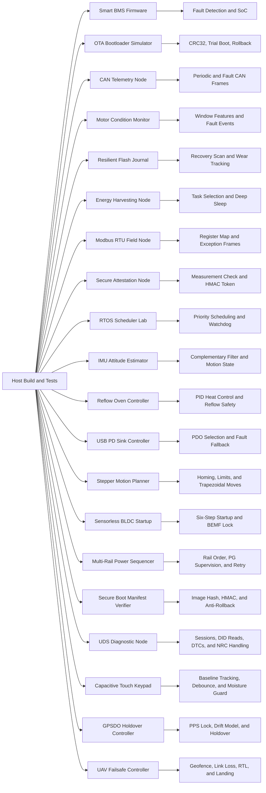

# Embedded Systems Portfolio Lab

[](https://github.com/akifitu/embedded-systems-portfolio-lab/actions/workflows/ci.yml)
[](LICENSE)
[](https://en.wikipedia.org/wiki/C_(programming_language))

This repository is an embedded-systems portfolio designed to look credible on
GitHub before any real board is connected. The code is written in portable C,
builds on the host with a standard compiler, and models the kind of firmware
problems that show up in production teams.

## Portfolio Signal

- Safety and control logic through a battery-management state machine
- Reliability and upgrade strategy through an A/B OTA bootloader model
- Bus communication literacy through a CAN telemetry scheduler
- Embedded diagnostics and fixed-point friendly DSP through a motor monitor
- Power-fail-safe persistence through a wear-aware flash journal
- Low-power duty cycling and energy budgeting through a harvesting node controller
- Industrial protocol handling through a Modbus RTU field device
- Firmware measurement and device identity proof through a secure attestation node
- Fixed-priority real-time scheduling through an RTOS scheduler laboratory
- IMU sensor fusion and motion-state estimation through an attitude estimator
- Thermal-process control through a reflow oven profile controller
- USB-C power negotiation and safe fallback through a USB PD sink controller
- Motion control through a stepper homing and trapezoidal trajectory planner
- Motor-drive startup logic through a sensorless BLDC commutation controller
- Board bring-up and rail supervision through a multi-rail power sequencer
- Boot-chain security through a secure boot manifest verifier
- Automotive diagnostics through a UDS session and security-access node
- HMI sensing through a capacitive touch keypad controller
- Timing discipline through a GPSDO holdover controller
- Autonomous recovery logic through a UAV failsafe controller
- Repeatability through `make test` and a GitHub Actions CI pipeline

## System Map



## Projects

| Project | Focus | Demo | Deep Dive |
| --- | --- | --- | --- |
| `smart-bms-firmware` | State machine, balancing, faults, SoC | `make run-bms` | [Architecture](projects/smart-bms-firmware/docs/ARCHITECTURE.md) |
| `ota-bootloader-simulator` | A/B staging, CRC32, confirm, rollback | `make run-ota` | [Architecture](projects/ota-bootloader-simulator/docs/ARCHITECTURE.md) |
| `can-telemetry-node` | CAN scheduling, fault priority, frame packing | `make run-can` | [Architecture](projects/can-telemetry-node/docs/ARCHITECTURE.md) |
| `motor-condition-monitor` | Windowed vibration analysis, fault classification, event log | `make run-motor` | [Architecture](projects/motor-condition-monitor/docs/ARCHITECTURE.md) |
| `resilient-flash-journal` | Crash-safe event persistence, replay, wear tracking | `make run-journal` | [Architecture](projects/resilient-flash-journal/docs/ARCHITECTURE.md) |
| `energy-harvesting-node` | Energy budget, task gating, brownout-safe duty cycling | `make run-power` | [Architecture](projects/energy-harvesting-node/docs/ARCHITECTURE.md) |
| `modbus-rtu-field-node` | Register map, CRC, Modbus function handling | `make run-modbus` | [Architecture](projects/modbus-rtu-field-node/docs/ARCHITECTURE.md) |
| `secure-attestation-node` | SHA-256 measurement, HMAC challenge-response, replay guard | `make run-attest` | [Architecture](projects/secure-attestation-node/docs/ARCHITECTURE.md) |
| `rtos-scheduler-lab` | Fixed-priority scheduling, deadline miss, watchdog | `make run-rtos` | [Architecture](projects/rtos-scheduler-lab/docs/ARCHITECTURE.md) |
| `imu-attitude-estimator` | Complementary filter, tilt estimation, motion states | `make run-imu` | [Architecture](projects/imu-attitude-estimator/docs/ARCHITECTURE.md) |
| `reflow-oven-controller` | Reflow profile tracking, PID heater control, safety interlocks | `make run-reflow` | [Architecture](projects/reflow-oven-controller/docs/ARCHITECTURE.md) |
| `usb-pd-sink-controller` | USB PD PDO selection, derating, retries, brownout fallback | `make run-pd` | [Architecture](projects/usb-pd-sink-controller/docs/ARCHITECTURE.md) |
| `stepper-motion-planner` | Homing, trapezoidal move planning, limit and stall faults | `make run-stepper` | [Architecture](projects/stepper-motion-planner/docs/ARCHITECTURE.md) |
| `sensorless-bldc-startup` | Six-step commutation, open-loop ramp, back-EMF lock and faults | `make run-bldc` | [Architecture](projects/sensorless-bldc-startup/docs/ARCHITECTURE.md) |
| `multi-rail-power-sequencer` | Rail ordering, power-good supervision, retries, brownout faults | `make run-sequencer` | [Architecture](projects/multi-rail-power-sequencer/docs/ARCHITECTURE.md) |
| `secure-boot-manifest-verifier` | Image hash, HMAC auth, anti-rollback, recovery fallback | `make run-sboot` | [Architecture](projects/secure-boot-manifest-verifier/docs/ARCHITECTURE.md) |
| `uds-diagnostic-node` | Session control, security access, DID reads, DTC services | `make run-uds` | [Architecture](projects/uds-diagnostic-node/docs/ARCHITECTURE.md) |
| `capacitive-touch-keypad-controller` | Baseline tracking, debounce, hold/combo events, moisture rejection | `make run-touch` | [Architecture](projects/capacitive-touch-keypad-controller/docs/ARCHITECTURE.md) |
| `gpsdo-holdover-controller` | PPS lock, DAC trim discipline, temperature-based holdover | `make run-gpsdo` | [Architecture](projects/gpsdo-holdover-controller/docs/ARCHITECTURE.md) |
| `uav-failsafe-controller` | Geofence monitoring, link-loss handling, RTL and emergency landing | `make run-uav` | [Architecture](projects/uav-failsafe-controller/docs/ARCHITECTURE.md) |

## Recorded Demo Snapshots

### Smart BMS Firmware

```text
step=0 state=IDLE soc=72.00 charge=1 discharge=1 faults=none balancing=[0 0 0 0]
step=1 state=CHARGING soc=72.02 charge=1 discharge=0 faults=none balancing=[0 0 0 1]
step=2 state=CHARGING soc=72.03 charge=1 discharge=0 faults=none balancing=[0 0 0 1]
step=3 state=DISCHARGING soc=72.00 charge=0 discharge=1 faults=none balancing=[0 0 0 0]
step=4 state=FAULT soc=72.00 charge=0 discharge=0 faults= overtemp balancing=[0 0 0 0]
```

### OTA Bootloader Simulator

```text
factory: v1.0.0 crc=19A140E2 size=16 confirmed=1
after test upgrade reboot: v1.1.0 crc=4CE93DFC size=22 confirmed=0
reboot without confirm: v1.0.0 crc=19A140E2 size=16 confirmed=1
after permanent upgrade reboot: v1.2.0 crc=0E7C2932 size=27 confirmed=1
final reboot: v1.2.0 crc=0E7C2932 size=27 confirmed=1
```

### CAN Telemetry Node

```text
tick=2 emitted=3
  vcan0 080 [2] 07 00 00 00 00 00 00 00
  vcan0 180 [6] 60 04 1E 00 D4 02 00 00
  vcan0 280 [4] 16 03 07 00 00 00 00 00
tick=4 emitted=2
  vcan0 080 [2] 00 00 00 00 00 00 00 00
  vcan0 180 [6] C0 12 28 00 CD 02 00 00
```

### Motor Condition Monitor

```text
phase=imbalance fault=IMBALANCE sev=WARNING rms=636 p2p=1800 jerk=217 current=5200 temp=38.0C events=1
phase=bearing fault=BEARING_WEAR sev=WARNING rms=740 p2p=2300 jerk=1262 current=5600 temp=41.0C events=2
phase=stall fault=STALL sev=CRITICAL rms=39 p2p=120 jerk=18 current=9800 temp=44.0C events=3
```

### Resilient Flash Journal

```text
boot_a valid=3 latest_seq=2 latest_type=OVERCURRENT erase=[0 0 0]
boot_b valid=9 latest_seq=11 latest_type=CONFIG_CHANGE erase=[1 0 0]
tail seq=9 type=WATCHDOG_RESET sev=WARNING value=1
tail seq=10 type=POWER_FAIL sev=CRITICAL value=1
tail seq=11 type=CONFIG_CHANGE sev=INFO value=7
```

### Energy Harvesting Node

```text
phase=dawn mode=BALANCED action=SAMPLE battery=5042mWh backlog=1 reserve=NO wake=15s
phase=sunny mode=PERFORMANCE action=TX battery=5861mWh backlog=0 reserve=NO wake=5s
phase=cloud mode=BALANCED action=SLEEP battery=5691mWh backlog=3 reserve=NO wake=20s
phase=brownout mode=SURVIVAL action=DEEP_SLEEP battery=1816mWh backlog=4 reserve=YES wake=60s
phase=night-recovery mode=BALANCED action=TX battery=4171mWh backlog=3 reserve=NO wake=5s
```

### Modbus RTU Field Node

```text
req1 11 03 00 00 00 04 46 99
rsp1 11 03 08 09 29 00 18 00 3C 00 02 D8 70
req2 11 06 00 11 00 19 1A 95
rsp2 11 06 00 11 00 19 1A 95
req3 11 03 00 10 00 02 C7 5E
rsp3 11 03 04 00 41 00 19 7A 2C
rsp4 11 93 01 8C F5
```

### Secure Attestation Node

```text
phase=golden boot=YES status=OK counter=41 token=f90d4a7232d03ec661a92da43581e5f8
phase=replay_guard boot=YES status=STALE_CHALLENGE counter=41 token=BLOCKED
phase=trusted_update boot=YES status=OK counter=42 token=4fc3bda9798b53048f171e8650cfbc19
phase=tampered boot=NO status=MEASUREMENT_MISMATCH counter=42 token=BLOCKED
```

### RTOS Scheduler Lab

```text
phase=nominal idle=25 misses=0 watchdog=OK starved=none last=control
phase=radio_burst idle=10 misses=0 watchdog=OK starved=none last=control
phase=sensor_stall idle=0 misses=14 watchdog=TRIPPED starved=control last=sensor
phase=recovery idle=22 misses=0 watchdog=OK starved=none last=control
```

### IMU Attitude Estimator

```text
phase=level roll=0.0 pitch=0.0 accel_norm=1.00 state=STABLE confidence=96
phase=tilt roll=0.0 pitch=28.6 accel_norm=1.00 state=TRACKING confidence=96
phase=vibration roll=18.9 pitch=22.0 accel_norm=1.19 state=VIBRATION confidence=63
phase=freefall roll=2.8 pitch=2.4 accel_norm=0.09 state=FREEFALL confidence=10
phase=recovery roll=0.6 pitch=4.0 accel_norm=1.00 state=TRACKING confidence=96
```

### Reflow Oven Controller

```text
phase=preheat stage=PREHEAT target=150.0 temp=110.5 heater=100 fan=0 progress=7 faults=none
phase=soak stage=SOAK target=180.0 temp=175.7 heater=81 fan=0 progress=42 faults=none
phase=reflow stage=REFLOW target=235.0 temp=181.5 heater=100 fan=0 progress=65 faults=none
phase=cooldown stage=COOL target=90.0 temp=148.4 heater=0 fan=100 progress=90 faults=none
phase=complete stage=COMPLETE target=40.0 temp=79.8 heater=0 fan=25 progress=100 faults=none
phase=sensor_fault stage=FAULT target=0.0 temp=178.0 heater=0 fan=100 progress=0 faults=sensor_open
```

### USB PD Sink Controller

```text
phase=attach_request state=REQUESTING req=20.0V/1.90A active=none power=38.0W retries=0 faults=none
phase=ready state=READY req=20.0V/1.90A active=20.0V/1.90A power=38.0W retries=0 faults=none
phase=thermal_derate state=DERATED req=9.0V/2.00A active=9.0V/2.00A power=18.0W retries=0 faults=none
phase=thin_cable state=READY req=20.0V/1.50A active=20.0V/1.50A power=30.0W retries=0 faults=none
phase=brownout state=FAULT req=5.0V/0.50A active=5.0V/0.50A power=2.5W retries=0 faults=brownout
phase=reject_loop state=FAULT req=5.0V/0.50A active=5.0V/0.50A power=2.5W retries=3 faults=retry_exhausted
```

### Stepper Motion Planner

```text
phase=home_seek state=HOMING pos=1240 target=0 rate=1200 dir=REV progress=50 faults=none
phase=home_latched state=READY pos=0 target=0 rate=0 dir=STOP progress=100 faults=none
phase=move_profile state=MOVING pos=1574 target=12000 rate=4800 dir=FWD progress=13 faults=none
phase=move_complete state=READY pos=12000 target=12000 rate=0 dir=STOP progress=100 faults=none
phase=limit_abort state=FAULT pos=15014 target=16000 rate=0 dir=STOP progress=75 faults=limit_hit
phase=rehome_complete state=READY pos=0 target=0 rate=0 dir=STOP progress=100 faults=none
```

### Sensorless BLDC Startup

```text
phase=align state=ALIGN sector=S1 duty=18 period=0us rpm=0 lock=SEEKING faults=none
phase=ramp state=OPEN_LOOP sector=S3 duty=26 period=2400us rpm=625 lock=SEEKING faults=none
phase=lock state=CLOSED_LOOP sector=S6 duty=34 period=806us rpm=1860 lock=LOCKED faults=none
phase=load_step state=CLOSED_LOOP sector=S1 duty=46 period=1063us rpm=1410 lock=LOCKED faults=none
phase=overcurrent state=FAULT sector=S6 duty=0 period=0us rpm=0 lock=LOST faults=overcurrent
phase=no_lock state=FAULT sector=S6 duty=0 period=0us rpm=0 lock=LOST faults=no_lock
```

### Multi-Rail Power Sequencer

```text
phase=boot_start state=STARTUP rail=CORE_1V0 mask=0x1 retries=0 progress=0 faults=none
phase=io_wait state=STARTUP rail=IO_1V8 mask=0x3 retries=0 progress=25 faults=none
phase=stable state=STABLE rail=NONE mask=0xF retries=0 progress=100 faults=none
phase=shutdown_complete state=IDLE rail=NONE mask=0x0 retries=0 progress=0 faults=none
phase=pg_timeout_retry state=RETRY_WAIT rail=CORE_1V0 mask=0x0 retries=1 progress=0 faults=pg_timeout
phase=recovered state=STABLE rail=NONE mask=0xF retries=1 progress=100 faults=none
phase=brownout_fault state=FAULT rail=NONE mask=0x0 retries=1 progress=100 faults=brownout
```

### Secure Boot Manifest Verifier

```text
phase=golden slot=PRIMARY verdict=BOOT counter=9 abi=3 product=0x42 reason=OK
phase=rollback slot=RECOVERY verdict=RECOVERY counter=11 abi=3 product=0x42 reason=ROLLBACK
phase=tamper slot=RECOVERY verdict=RECOVERY counter=11 abi=3 product=0x42 reason=HASH_MISMATCH
phase=wrong_product slot=RECOVERY verdict=RECOVERY counter=11 abi=3 product=0x42 reason=PRODUCT_MISMATCH
phase=recovery_only slot=RECOVERY verdict=RECOVERY counter=11 abi=3 product=0x42 reason=MISSING_SLOT
phase=hard_fail slot=NONE verdict=REJECT counter=8 abi=3 product=0x42 reason=AUTH_FAILED
```

### UDS Diagnostic Node

```text
phase=session req=10 03 rsp=50 03 session=EXTENDED security=LOCKED dtc=2
phase=vin req=22 F1 90 rsp=62 F1 90 41 4B 49 46 49 52 4D 57 session=EXTENDED security=LOCKED dtc=2
phase=seed req=27 01 rsp=67 01 3A C5 session=EXTENDED security=SEED_ISSUED dtc=2
phase=unlock req=27 02 96 68 rsp=67 02 session=EXTENDED security=UNLOCKED dtc=2
phase=dtc req=19 02 rsp=59 02 02 10 11 01 C2 22 02 session=EXTENDED security=UNLOCKED dtc=2
phase=clear req=14 FF FF FF rsp=54 session=EXTENDED security=UNLOCKED dtc=0
phase=bad_key req=27 02 00 00 rsp=7F 27 35 session=EXTENDED security=LOCKED dtc=2
```

### Capacitive Touch Keypad Controller

```text
phase=idle active=NONE event=NONE moisture=DRY faults=none baselines=1000/1004/998/1002
phase=tap_ok active=NONE event=TAP_OK moisture=DRY faults=none baselines=1000/1004/998/1002
phase=hold_back active=BACK event=HOLD_BACK moisture=DRY faults=none baselines=1000/1004/998/1002
phase=combo active=NONE event=COMBO_UP_OK moisture=DRY faults=none baselines=1000/1004/998/1002
phase=moisture active=NONE event=NONE moisture=WET faults=moisture baselines=1000/1004/998/1002
phase=recovery active=NONE event=TAP_DOWN moisture=DRY faults=none baselines=1000/1004/998/1002
```

### GPSDO Holdover Controller

```text
phase=warmup state=ACQUIRE trim=2041 phase=180ns temp=24.0C pps=YES uncertainty=0ns quality=SEARCH
phase=locked state=TRACKING trim=2038 phase=12ns temp=24.2C pps=YES uncertainty=0ns quality=LOCKED
phase=holdover_30s state=HOLDOVER trim=2058 phase=28ns temp=26.0C pps=NO uncertainty=95ns quality=HOLDOVER
phase=holdover_2m state=HOLDOVER trim=2060 phase=74ns temp=27.5C pps=NO uncertainty=410ns quality=HOLDOVER
phase=relock state=TRACKING trim=2055 phase=6ns temp=25.0C pps=YES uncertainty=0ns quality=LOCKED
phase=bad_pps state=FAULT trim=2048 phase=8500ns temp=25.0C pps=YES uncertainty=0ns quality=FAULT
```

### UAV Failsafe Controller

```text
phase=launch state=MISSION cmd=PROCEED reason=NONE battery=92 reserve=73 budget=19 link=0 fence=IN health=GREEN
phase=geofence state=RTL cmd=RETURN_HOME reason=GEOFENCE battery=78 reserve=36 budget=42 link=0 fence=OUT health=YELLOW
phase=link_loss state=RTL cmd=RETURN_HOME reason=LINK_LOSS battery=68 reserve=38 budget=30 link=3 fence=IN health=YELLOW
phase=nav_loss state=LAND cmd=DESCEND reason=NAV_LOSS battery=61 reserve=33 budget=28 link=2 fence=IN health=RED
phase=critical_battery state=LAND cmd=DESCEND reason=CRITICAL_BATTERY battery=9 reserve=0 budget=16 link=0 fence=IN health=RED
phase=touchdown state=DISARMED cmd=CUT_MOTORS reason=NONE battery=8 reserve=0 budget=14 link=0 fence=IN health=RED
```

## Build

Build and test everything:

```sh
make all
make test
```

Run project demos:

```sh
make run-bms
make run-ota
make run-can
make run-motor
make run-journal
make run-power
make run-modbus
make run-attest
make run-rtos
make run-imu
make run-reflow
make run-pd
make run-stepper
make run-bldc
make run-sequencer
make run-sboot
make run-uds
make run-touch
make run-gpsdo
make run-uav
```

## Why This Set Works on GitHub

- It covers control, reliability, and communications instead of only toy sensor code.
- Each project produces deterministic output that reviewers can inspect quickly.
- The repository is split into standalone subprojects that can later become separate repos.

## Suggested Next Hardware Targets

- Port the BMS project to STM32 or ESP32 with ADC, GPIO, and contactor control
- Port the OTA simulator to Zephyr or MCUboot integration tests
- Bridge the CAN node to Linux `vcan` or a real MCP2515 transceiver
- Port the motor monitor to an accelerometer + DMA ADC capture chain on STM32
- Port the flash journal to real NOR/QSPI flash with brownout-triggered flush
- Port the harvesting node to a solar charger + ADC coulomb counter board
- Port the Modbus field node to RS-485 transceivers with UART DMA
- Port the secure attestation node to a secure element or TrustZone-backed key store
- Port the RTOS lab to FreeRTOS or Zephyr task traces on real hardware
- Port the IMU estimator to an MPU6050 or BMI270 SPI/I2C driver stack
- Port the reflow controller to an STM32, MAX31855 thermocouple frontend, and SSR output stage
- Port the USB PD sink controller to an STM32, FUSB302 or STUSB4500, and real power-path telemetry
- Port the stepper planner to an STM32 or RP2040 with TMC2209/A4988 drivers and real limit switches
- Port the BLDC startup controller to an STM32 with timer PWM, comparator-based zero-cross sensing, and gate drivers
- Port the power sequencer to an STM32 supervisor MCU with PG GPIOs, PMIC enables, and brownout ADC monitoring
- Port the secure boot verifier to MCUboot-style ROM or first-stage bootloader firmware with OTP-backed counters
- Port the UDS node to CAN ISO-TP on STM32 or an automotive MCU with real DID and DTC storage
- Port the touch keypad to STM32 TSC, Microchip PTC, or ESP32 touch peripherals with real electrode layouts
- Port the GPSDO controller to an STM32 or RP2040 with PPS capture, DAC trim output, and ovenized oscillator telemetry
- Port the UAV failsafe controller to an STM32 or PX4-class autopilot with GPS, RC RSSI, barometer, and battery telemetry

## References

- Zephyr native host execution:
  https://docs.zephyrproject.org/3.7.0/boards/native/native_posix/doc/index.html
- SocketCAN overview and `vcan` virtual interfaces:
  https://docs.kernel.org/networking/can.html
- MCUboot image signing and upgrade concepts:
  https://docs.mcuboot.com/signed_images.html
  https://docs.mcuboot.com/imgtool.html
