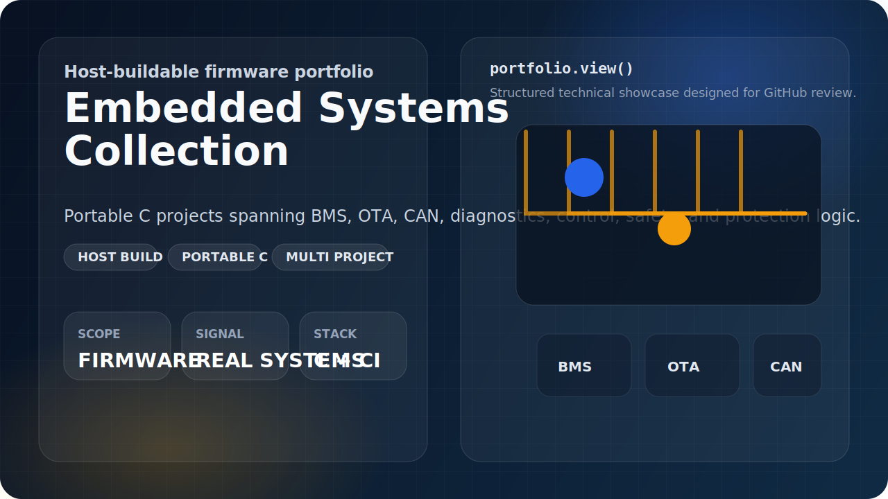
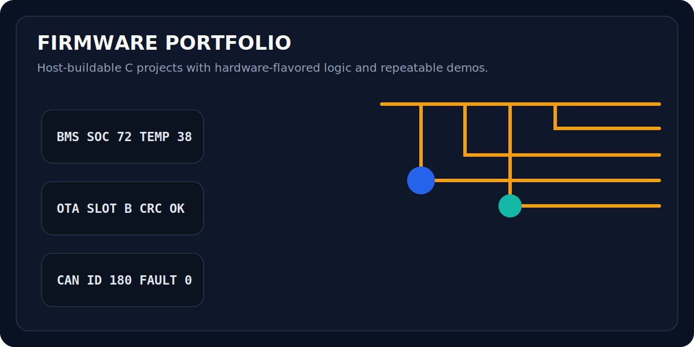

# Embedded Systems Collection

<p align="center">
  
</p>

<p align="center">
  
  
  
  
</p>

This repository is an embedded-systems portfolio designed to look credible on
GitHub before any real board is connected. The code is written in portable C,
builds on the host with a standard compiler, and models the kind of firmware
problems that show up in production teams.

## Demo Preview

<p align="center">
  
</p>

## Portfolio Signal

- Safety and control logic through a battery-management state machine
- Reliability and upgrade strategy through an A/B OTA bootloader model
- Bus communication literacy through a CAN telemetry scheduler
- Embedded diagnostics and fixed-point friendly DSP through a motor monitor
- Power-fail-safe persistence through a wear-aware flash journal
- Low-power duty cycling and energy budgeting through a harvesting node controller
- Industrial protocol handling through a Modbus RTU field device
- Firmware measurement and device identity proof through a secure attestation node
- Fixed-priority real-time scheduling through an RTOS scheduler laboratory
- IMU sensor fusion and motion-state estimation through an attitude estimator
- Thermal-process control through a reflow oven profile controller
- USB-C power negotiation and safe fallback through a USB PD sink controller
- Motion control through a stepper homing and trapezoidal trajectory planner
- Motor-drive startup logic through a sensorless BLDC commutation controller
- Board bring-up and rail supervision through a multi-rail power sequencer
- Boot-chain security through a secure boot manifest verifier
- Automotive diagnostics through a UDS session and security-access node
- HMI sensing through a capacitive touch keypad controller
- Timing discipline through a GPSDO holdover controller
- Autonomous recovery logic through a UAV failsafe controller
- Grid-interconnect protection through an inverter guard controller
- Chassis slip control through an ABS brake controller
- EV charge-port sequencing through an EVSE controller
- Fluid-process automation through a dual-pump lift-station controller
- Backup-power orchestration through a diesel generator autostart controller
- Railway warning control through a grade-crossing controller
- Building life-safety logic through a fire panel loop controller
- Medical-device dosing safety through an infusion pump controller
- Vertical-transport protection through an elevator door safety controller
- Spacecraft power autonomy through a satellite EPS load-shed controller
- Combustion lockout logic through a gas burner flame safeguard controller
- Renewable-energy shutdown logic through a wind turbine pitch safety controller
- Respiratory safety logic through a ventilator breath cycle controller
- Solar power conversion through an MPPT charge controller
- Modular high-current docking safety through a battery swap dock controller
- Repeatability through `make test` and a GitHub Actions CI pipeline

## System Map

```mermaid
flowchart LR
    Host[Host Build and Tests] --> BMS[Smart BMS Firmware]
    Host --> OTA[OTA Bootloader Simulator]
    Host --> CAN[CAN Telemetry Node]
    Host --> MCM[Motor Condition Monitor]
    Host --> RFJ[Resilient Flash Journal]
    Host --> EHN[Energy Harvesting Node]
    Host --> MB[Modbus RTU Field Node]
    Host --> SAN[Secure Attestation Node]
    Host --> RTOS[RTOS Scheduler Lab]
    Host --> IMU[IMU Attitude Estimator]
    Host --> RO[Reflow Oven Controller]
    Host --> PD[USB PD Sink Controller]
    Host --> SMP[Stepper Motion Planner]
    Host --> BLDC[Sensorless BLDC Startup]
    Host --> PSEQ[Multi-Rail Power Sequencer]
    Host --> SBV[Secure Boot Manifest Verifier]
    Host --> UDS[UDS Diagnostic Node]
    Host --> TOUCH[Capacitive Touch Keypad]
    Host --> GPSDO[GPSDO Holdover Controller]
    Host --> UAV[UAV Failsafe Controller]
    Host --> INV[Grid-Tie Inverter Guard]
    Host --> ABS[Wheel-Slip ABS Controller]
    Host --> EVSE[EVSE Charge Port Controller]
    Host --> LIFT[Dual-Pump Lift Station Controller]
    Host --> GEN[Diesel Generator Autostart Controller]
    Host --> XING[Railway Grade Crossing Controller]
    Host --> FIRE[Fire Panel Loop Controller]
    Host --> INFUSE[Infusion Pump Safety Controller]
    Host --> ELEV[Elevator Door Safety Controller]
    Host --> SEPS[Satellite EPS Load Shed Controller]
    Host --> BURNER[Gas Burner Flame Safeguard Controller]
    Host --> WT[Wind Turbine Pitch Safety Controller]
    Host --> VENT[Ventilator Breath Cycle Controller]
    Host --> SOLAR[Solar MPPT Charge Controller]
    Host --> SWAP[Battery Swap Dock Controller]
    BMS --> Safety[Fault Detection and SoC]
    OTA --> Reliability[CRC32, Trial Boot, Rollback]
    CAN --> VehicleBus[Periodic and Fault CAN Frames]
    MCM --> Predictive[Window Features and Fault Events]
    RFJ --> Persistence[Recovery Scan and Wear Tracking]
    EHN --> Power[Task Selection and Deep Sleep]
    MB --> Industrial[Register Map and Exception Frames]
    SAN --> Trust[Measurement Check and HMAC Token]
    RTOS --> Timing[Priority Scheduling and Watchdog]
    IMU --> Fusion[Complementary Filter and Motion State]
    RO --> Thermal[PID Heat Control and Reflow Safety]
    PD --> Negotiation[PDO Selection and Fault Fallback]
    SMP --> Motion[Homing, Limits, and Trapezoidal Moves]
    BLDC --> Drive[Six-Step Startup and BEMF Lock]
    PSEQ --> BoardPower[Rail Order, PG Supervision, and Retry]
    SBV --> Chain[Image Hash, HMAC, and Anti-Rollback]
    UDS --> Diag[Sessions, DID Reads, DTCs, and NRC Handling]
    TOUCH --> HMI[Baseline Tracking, Debounce, and Moisture Guard]
    GPSDO --> Timing2[PPS Lock, Drift Model, and Holdover]
    UAV --> Flight[Geofence, Link Loss, RTL, and Landing]
    INV --> GridPower[Anti-Islanding, Sync, and Thermal Derating]
    ABS --> Chassis[Slip Control, Valve Modulation, and Fault Detection]
    EVSE --> Charging[Control Pilot, GFCI, Contactor, and Derating]
    LIFT --> Water[Lead-Lag Pumps, Wet-Well Level, and Overflow Protection]
    GEN --> Backup[Utility Loss, Crank Retry, Warmup, and Cooldown]
    XING --> Rail[Approach Warning, Gate Motion, and Lamp Fault Lockout]
    FIRE --> LifeSafety[Smoke Verify, NAC Silence, and Trouble Latching]
    INFUSE --> MedDevice[Occlusion Alarms, KVO, and Therapy Reset]
    ELEV --> BuildingTransport[Obstruction Recovery, Nudge Mode, and Lock Supervision]
    SEPS --> SpacePower[Load Shedding, Survival Mode, and Eclipse Recovery]
    BURNER --> Combustion[Prepurge, Flame Prove, and Hard Lockout]
    WT --> Renewable[Feathering, Storm Hold, and Pitch Fault Lockout]
    VENT --> Respiratory[Backup Breaths, Plateau Hold, and Patient Alarms]
    SOLAR --> PowerConv[MPPT Duty Tracking, Absorb Float, and Thermal Fault Lockout]
    SWAP --> Docking[Pack Validation, Precharge, Latch, and Safe Release]
```



## Projects

| Project | Focus | Demo | Deep Dive |
| --- | --- | --- | --- |
| `smart-bms-firmware` | State machine, balancing, faults, SoC | `make run-bms` | [Architecture](projects/smart-bms-firmware/docs/ARCHITECTURE.md) |
| `ota-bootloader-simulator` | A/B staging, CRC32, confirm, rollback | `make run-ota` | [Architecture](projects/ota-bootloader-simulator/docs/ARCHITECTURE.md) |
| `can-telemetry-node` | CAN scheduling, fault priority, frame packing | `make run-can` | [Architecture](projects/can-telemetry-node/docs/ARCHITECTURE.md) |
| `motor-condition-monitor` | Windowed vibration analysis, fault classification, event log | `make run-motor` | [Architecture](projects/motor-condition-monitor/docs/ARCHITECTURE.md) |
| `resilient-flash-journal` | Crash-safe event persistence, replay, wear tracking | `make run-journal` | [Architecture](projects/resilient-flash-journal/docs/ARCHITECTURE.md) |
| `energy-harvesting-node` | Energy budget, task gating, brownout-safe duty cycling | `make run-power` | [Architecture](projects/energy-harvesting-node/docs/ARCHITECTURE.md) |
| `modbus-rtu-field-node` | Register map, CRC, Modbus function handling | `make run-modbus` | [Architecture](projects/modbus-rtu-field-node/docs/ARCHITECTURE.md) |
| `secure-attestation-node` | SHA-256 measurement, HMAC challenge-response, replay guard | `make run-attest` | [Architecture](projects/secure-attestation-node/docs/ARCHITECTURE.md) |
| `rtos-scheduler-lab` | Fixed-priority scheduling, deadline miss, watchdog | `make run-rtos` | [Architecture](projects/rtos-scheduler-lab/docs/ARCHITECTURE.md) |
| `imu-attitude-estimator` | Complementary filter, tilt estimation, motion states | `make run-imu` | [Architecture](projects/imu-attitude-estimator/docs/ARCHITECTURE.md) |
| `reflow-oven-controller` | Reflow profile tracking, PID heater control, safety interlocks | `make run-reflow` | [Architecture](projects/reflow-oven-controller/docs/ARCHITECTURE.md) |
| `usb-pd-sink-controller` | USB PD PDO selection, derating, retries, brownout fallback | `make run-pd` | [Architecture](projects/usb-pd-sink-controller/docs/ARCHITECTURE.md) |
| `stepper-motion-planner` | Homing, trapezoidal move planning, limit and stall faults | `make run-stepper` | [Architecture](projects/stepper-motion-planner/docs/ARCHITECTURE.md) |
| `sensorless-bldc-startup` | Six-step commutation, open-loop ramp, back-EMF lock and faults | `make run-bldc` | [Architecture](projects/sensorless-bldc-startup/docs/ARCHITECTURE.md) |
| `multi-rail-power-sequencer` | Rail ordering, power-good supervision, retries, brownout faults | `make run-sequencer` | [Architecture](projects/multi-rail-power-sequencer/docs/ARCHITECTURE.md) |
| `secure-boot-manifest-verifier` | Image hash, HMAC auth, anti-rollback, recovery fallback | `make run-sboot` | [Architecture](projects/secure-boot-manifest-verifier/docs/ARCHITECTURE.md) |
| `uds-diagnostic-node` | Session control, security access, DID reads, DTC services | `make run-uds` | [Architecture](projects/uds-diagnostic-node/docs/ARCHITECTURE.md) |
| `capacitive-touch-keypad-controller` | Baseline tracking, debounce, hold/combo events, moisture rejection | `make run-touch` | [Architecture](projects/capacitive-touch-keypad-controller/docs/ARCHITECTURE.md) |
| `gpsdo-holdover-controller` | PPS lock, DAC trim discipline, temperature-based holdover | `make run-gpsdo` | [Architecture](projects/gpsdo-holdover-controller/docs/ARCHITECTURE.md) |
| `uav-failsafe-controller` | Geofence monitoring, link-loss handling, RTL and emergency landing | `make run-uav` | [Architecture](projects/uav-failsafe-controller/docs/ARCHITECTURE.md) |
| `grid-tie-inverter-guard` | Grid sync, anti-islanding trips, cooldown, thermal export derating | `make run-inverter` | [Architecture](projects/grid-tie-inverter-guard/docs/ARCHITECTURE.md) |
| `wheel-slip-abs-controller` | Slip estimation, hydraulic valve modulation, wheel-sensor fault handling | `make run-abs` | [Architecture](projects/wheel-slip-abs-controller/docs/ARCHITECTURE.md) |
| `evse-charge-port-controller` | Pilot-state decode, current advertisement, GFCI trip, cooldown recovery | `make run-evse` | [Architecture](projects/evse-charge-port-controller/docs/ARCHITECTURE.md) |
| `dual-pump-lift-station-controller` | Lead-lag alternation, high-high assist, seal fault lockout | `make run-lift` | [Architecture](projects/dual-pump-lift-station-controller/docs/ARCHITECTURE.md) |
| `diesel-generator-autostart-controller` | Utility-loss autostart, crank retry, low-oil fault, cooldown stop | `make run-gen` | [Architecture](projects/diesel-generator-autostart-controller/docs/ARCHITECTURE.md) |
| `railway-grade-crossing-controller` | Approach warning, gate sequencing, lamp fault and gate-timeout lockout | `make run-crossing` | [Architecture](projects/railway-grade-crossing-controller/docs/ARCHITECTURE.md) |
| `fire-panel-loop-controller` | Smoke verification, NAC silence, manual-pull alarm, and supervised-loop trouble latching | `make run-fire` | [Architecture](projects/fire-panel-loop-controller/docs/ARCHITECTURE.md) |
| `infusion-pump-safety-controller` | Priming, infusion, KVO fallback, and occlusion or air-in-line alarm shutdown | `make run-infusion` | [Architecture](projects/infusion-pump-safety-controller/docs/ARCHITECTURE.md) |
| `elevator-door-safety-controller` | Opening, obstruction retry, nudge close, and door-lock or motion-timeout fault handling | `make run-elevator` | [Architecture](projects/elevator-door-safety-controller/docs/ARCHITECTURE.md) |
| `satellite-eps-load-shed-controller` | Eclipse load shedding, survival mode, recovery, and battery or bus protection | `make run-sat-eps` | [Architecture](projects/satellite-eps-load-shed-controller/docs/ARCHITECTURE.md) |
| `gas-burner-flame-safeguard-controller` | Prepurge, ignition prove, postpurge, and airflow or interlock lockout handling | `make run-burner` | [Architecture](projects/gas-burner-flame-safeguard-controller/docs/ARCHITECTURE.md) |
| `wind-turbine-pitch-safety-controller` | Startup release, generating trim, grid-loss feathering, and storm-hold or pitch fault handling | `make run-wind` | [Architecture](projects/wind-turbine-pitch-safety-controller/docs/ARCHITECTURE.md) |
| `ventilator-breath-cycle-controller` | Patient-triggered inhale, backup breaths, plateau hold, and respiratory alarm handling | `make run-vent` | [Architecture](projects/ventilator-breath-cycle-controller/docs/ARCHITECTURE.md) |
| `solar-mppt-charge-controller` | Perturb-observe MPPT, bulk or absorb or float charging, and reverse or thermal fault handling | `make run-solar` | [Architecture](projects/solar-mppt-charge-controller/docs/ARCHITECTURE.md) |
| `battery-swap-dock-controller` | Pack validation, precharge sequencing, dock latch control, and thermal or auth fault lockout | `make run-swap` | [Architecture](projects/battery-swap-dock-controller/docs/ARCHITECTURE.md) |

## Recorded Demo Snapshots

### Smart BMS Firmware

```text
step=0 state=IDLE soc=72.00 charge=1 discharge=1 faults=none balancing=[0 0 0 0]
step=1 state=CHARGING soc=72.02 charge=1 discharge=0 faults=none balancing=[0 0 0 1]
step=2 state=CHARGING soc=72.03 charge=1 discharge=0 faults=none balancing=[0 0 0 1]
step=3 state=DISCHARGING soc=72.00 charge=0 discharge=1 faults=none balancing=[0 0 0 0]
step=4 state=FAULT soc=72.00 charge=0 discharge=0 faults= overtemp balancing=[0 0 0 0]
```

### OTA Bootloader Simulator

```text
factory: v1.0.0 crc=19A140E2 size=16 confirmed=1
after test upgrade reboot: v1.1.0 crc=4CE93DFC size=22 confirmed=0
reboot without confirm: v1.0.0 crc=19A140E2 size=16 confirmed=1
after permanent upgrade reboot: v1.2.0 crc=0E7C2932 size=27 confirmed=1
final reboot: v1.2.0 crc=0E7C2932 size=27 confirmed=1
```

### CAN Telemetry Node

```text
tick=2 emitted=3
  vcan0 080 [2] 07 00 00 00 00 00 00 00
  vcan0 180 [6] 60 04 1E 00 D4 02 00 00
  vcan0 280 [4] 16 03 07 00 00 00 00 00
tick=4 emitted=2
  vcan0 080 [2] 00 00 00 00 00 00 00 00
  vcan0 180 [6] C0 12 28 00 CD 02 00 00
```

### Motor Condition Monitor

```text
phase=imbalance fault=IMBALANCE sev=WARNING rms=636 p2p=1800 jerk=217 current=5200 temp=38.0C events=1
phase=bearing fault=BEARING_WEAR sev=WARNING rms=740 p2p=2300 jerk=1262 current=5600 temp=41.0C events=2
phase=stall fault=STALL sev=CRITICAL rms=39 p2p=120 jerk=18 current=9800 temp=44.0C events=3
```

### Resilient Flash Journal

```text
boot_a valid=3 latest_seq=2 latest_type=OVERCURRENT erase=[0 0 0]
boot_b valid=9 latest_seq=11 latest_type=CONFIG_CHANGE erase=[1 0 0]
tail seq=9 type=WATCHDOG_RESET sev=WARNING value=1
tail seq=10 type=POWER_FAIL sev=CRITICAL value=1
tail seq=11 type=CONFIG_CHANGE sev=INFO value=7
```

### Energy Harvesting Node

```text
phase=dawn mode=BALANCED action=SAMPLE battery=5042mWh backlog=1 reserve=NO wake=15s
phase=sunny mode=PERFORMANCE action=TX battery=5861mWh backlog=0 reserve=NO wake=5s
phase=cloud mode=BALANCED action=SLEEP battery=5691mWh backlog=3 reserve=NO wake=20s
phase=brownout mode=SURVIVAL action=DEEP_SLEEP battery=1816mWh backlog=4 reserve=YES wake=60s
phase=night-recovery mode=BALANCED action=TX battery=4171mWh backlog=3 reserve=NO wake=5s
```

### Modbus RTU Field Node

```text
req1 11 03 00 00 00 04 46 99
rsp1 11 03 08 09 29 00 18 00 3C 00 02 D8 70
req2 11 06 00 11 00 19 1A 95
rsp2 11 06 00 11 00 19 1A 95
req3 11 03 00 10 00 02 C7 5E
rsp3 11 03 04 00 41 00 19 7A 2C
rsp4 11 93 01 8C F5
```

### Secure Attestation Node

```text
phase=golden boot=YES status=OK counter=41 token=f90d4a7232d03ec661a92da43581e5f8
phase=replay_guard boot=YES status=STALE_CHALLENGE counter=41 token=BLOCKED
phase=trusted_update boot=YES status=OK counter=42 token=4fc3bda9798b53048f171e8650cfbc19
phase=tampered boot=NO status=MEASUREMENT_MISMATCH counter=42 token=BLOCKED
```

### RTOS Scheduler Lab

```text
phase=nominal idle=25 misses=0 watchdog=OK starved=none last=control
phase=radio_burst idle=10 misses=0 watchdog=OK starved=none last=control
phase=sensor_stall idle=0 misses=14 watchdog=TRIPPED starved=control last=sensor
phase=recovery idle=22 misses=0 watchdog=OK starved=none last=control
```

### IMU Attitude Estimator

```text
phase=level roll=0.0 pitch=0.0 accel_norm=1.00 state=STABLE confidence=96
phase=tilt roll=0.0 pitch=28.6 accel_norm=1.00 state=TRACKING confidence=96
phase=vibration roll=18.9 pitch=22.0 accel_norm=1.19 state=VIBRATION confidence=63
phase=freefall roll=2.8 pitch=2.4 accel_norm=0.09 state=FREEFALL confidence=10
phase=recovery roll=0.6 pitch=4.0 accel_norm=1.00 state=TRACKING confidence=96
```

### Reflow Oven Controller

```text
phase=preheat stage=PREHEAT target=150.0 temp=110.5 heater=100 fan=0 progress=7 faults=none
phase=soak stage=SOAK target=180.0 temp=175.7 heater=81 fan=0 progress=42 faults=none
phase=reflow stage=REFLOW target=235.0 temp=181.5 heater=100 fan=0 progress=65 faults=none
phase=cooldown stage=COOL target=90.0 temp=148.4 heater=0 fan=100 progress=90 faults=none
phase=complete stage=COMPLETE target=40.0 temp=79.8 heater=0 fan=25 progress=100 faults=none
phase=sensor_fault stage=FAULT target=0.0 temp=178.0 heater=0 fan=100 progress=0 faults=sensor_open
```

### USB PD Sink Controller

```text
phase=attach_request state=REQUESTING req=20.0V/1.90A active=none power=38.0W retries=0 faults=none
phase=ready state=READY req=20.0V/1.90A active=20.0V/1.90A power=38.0W retries=0 faults=none
phase=thermal_derate state=DERATED req=9.0V/2.00A active=9.0V/2.00A power=18.0W retries=0 faults=none
phase=thin_cable state=READY req=20.0V/1.50A active=20.0V/1.50A power=30.0W retries=0 faults=none
phase=brownout state=FAULT req=5.0V/0.50A active=5.0V/0.50A power=2.5W retries=0 faults=brownout
phase=reject_loop state=FAULT req=5.0V/0.50A active=5.0V/0.50A power=2.5W retries=3 faults=retry_exhausted
```

### Stepper Motion Planner

```text
phase=home_seek state=HOMING pos=1240 target=0 rate=1200 dir=REV progress=50 faults=none
phase=home_latched state=READY pos=0 target=0 rate=0 dir=STOP progress=100 faults=none
phase=move_profile state=MOVING pos=1574 target=12000 rate=4800 dir=FWD progress=13 faults=none
phase=move_complete state=READY pos=12000 target=12000 rate=0 dir=STOP progress=100 faults=none
phase=limit_abort state=FAULT pos=15014 target=16000 rate=0 dir=STOP progress=75 faults=limit_hit
phase=rehome_complete state=READY pos=0 target=0 rate=0 dir=STOP progress=100 faults=none
```

### Sensorless BLDC Startup

```text
phase=align state=ALIGN sector=S1 duty=18 period=0us rpm=0 lock=SEEKING faults=none
phase=ramp state=OPEN_LOOP sector=S3 duty=26 period=2400us rpm=625 lock=SEEKING faults=none
phase=lock state=CLOSED_LOOP sector=S6 duty=34 period=806us rpm=1860 lock=LOCKED faults=none
phase=load_step state=CLOSED_LOOP sector=S1 duty=46 period=1063us rpm=1410 lock=LOCKED faults=none
phase=overcurrent state=FAULT sector=S6 duty=0 period=0us rpm=0 lock=LOST faults=overcurrent
phase=no_lock state=FAULT sector=S6 duty=0 period=0us rpm=0 lock=LOST faults=no_lock
```

### Multi-Rail Power Sequencer

```text
phase=boot_start state=STARTUP rail=CORE_1V0 mask=0x1 retries=0 progress=0 faults=none
phase=io_wait state=STARTUP rail=IO_1V8 mask=0x3 retries=0 progress=25 faults=none
phase=stable state=STABLE rail=NONE mask=0xF retries=0 progress=100 faults=none
phase=shutdown_complete state=IDLE rail=NONE mask=0x0 retries=0 progress=0 faults=none
phase=pg_timeout_retry state=RETRY_WAIT rail=CORE_1V0 mask=0x0 retries=1 progress=0 faults=pg_timeout
phase=recovered state=STABLE rail=NONE mask=0xF retries=1 progress=100 faults=none
phase=brownout_fault state=FAULT rail=NONE mask=0x0 retries=1 progress=100 faults=brownout
```

### Secure Boot Manifest Verifier

```text
phase=golden slot=PRIMARY verdict=BOOT counter=9 abi=3 product=0x42 reason=OK
phase=rollback slot=RECOVERY verdict=RECOVERY counter=11 abi=3 product=0x42 reason=ROLLBACK
phase=tamper slot=RECOVERY verdict=RECOVERY counter=11 abi=3 product=0x42 reason=HASH_MISMATCH
phase=wrong_product slot=RECOVERY verdict=RECOVERY counter=11 abi=3 product=0x42 reason=PRODUCT_MISMATCH
phase=recovery_only slot=RECOVERY verdict=RECOVERY counter=11 abi=3 product=0x42 reason=MISSING_SLOT
phase=hard_fail slot=NONE verdict=REJECT counter=8 abi=3 product=0x42 reason=AUTH_FAILED
```

### UDS Diagnostic Node

```text
phase=session req=10 03 rsp=50 03 session=EXTENDED security=LOCKED dtc=2
phase=vin req=22 F1 90 rsp=62 F1 90 41 4B 49 46 49 52 4D 57 session=EXTENDED security=LOCKED dtc=2
phase=seed req=27 01 rsp=67 01 3A C5 session=EXTENDED security=SEED_ISSUED dtc=2
phase=unlock req=27 02 96 68 rsp=67 02 session=EXTENDED security=UNLOCKED dtc=2
phase=dtc req=19 02 rsp=59 02 02 10 11 01 C2 22 02 session=EXTENDED security=UNLOCKED dtc=2
phase=clear req=14 FF FF FF rsp=54 session=EXTENDED security=UNLOCKED dtc=0
phase=bad_key req=27 02 00 00 rsp=7F 27 35 session=EXTENDED security=LOCKED dtc=2
```

### Capacitive Touch Keypad Controller

```text
phase=idle active=NONE event=NONE moisture=DRY faults=none baselines=1000/1004/998/1002
phase=tap_ok active=NONE event=TAP_OK moisture=DRY faults=none baselines=1000/1004/998/1002
phase=hold_back active=BACK event=HOLD_BACK moisture=DRY faults=none baselines=1000/1004/998/1002
phase=combo active=NONE event=COMBO_UP_OK moisture=DRY faults=none baselines=1000/1004/998/1002
phase=moisture active=NONE event=NONE moisture=WET faults=moisture baselines=1000/1004/998/1002
phase=recovery active=NONE event=TAP_DOWN moisture=DRY faults=none baselines=1000/1004/998/1002
```

### GPSDO Holdover Controller

```text
phase=warmup state=ACQUIRE trim=2041 phase=180ns temp=24.0C pps=YES uncertainty=0ns quality=SEARCH
phase=locked state=TRACKING trim=2038 phase=12ns temp=24.2C pps=YES uncertainty=0ns quality=LOCKED
phase=holdover_30s state=HOLDOVER trim=2058 phase=28ns temp=26.0C pps=NO uncertainty=95ns quality=HOLDOVER
phase=holdover_2m state=HOLDOVER trim=2060 phase=74ns temp=27.5C pps=NO uncertainty=410ns quality=HOLDOVER
phase=relock state=TRACKING trim=2055 phase=6ns temp=25.0C pps=YES uncertainty=0ns quality=LOCKED
phase=bad_pps state=FAULT trim=2048 phase=8500ns temp=25.0C pps=YES uncertainty=0ns quality=FAULT
```

### UAV Failsafe Controller

```text
phase=launch state=MISSION cmd=PROCEED reason=NONE battery=92 reserve=73 budget=19 link=0 fence=IN health=GREEN
phase=geofence state=RTL cmd=RETURN_HOME reason=GEOFENCE battery=78 reserve=36 budget=42 link=0 fence=OUT health=YELLOW
phase=link_loss state=RTL cmd=RETURN_HOME reason=LINK_LOSS battery=68 reserve=38 budget=30 link=3 fence=IN health=YELLOW
phase=nav_loss state=LAND cmd=DESCEND reason=NAV_LOSS battery=61 reserve=33 budget=28 link=2 fence=IN health=RED
phase=critical_battery state=LAND cmd=DESCEND reason=CRITICAL_BATTERY battery=9 reserve=0 budget=16 link=0 fence=IN health=RED
phase=touchdown state=DISARMED cmd=CUT_MOTORS reason=NONE battery=8 reserve=0 budget=14 link=0 fence=IN health=RED
```

### Grid-Tie Inverter Guard

```text
phase=boot_wait state=WAIT_GRID cmd=OPEN_RELAY reason=NONE limit=0 sync=0 v=0 f=0.000Hz relay=OPEN quality=SEARCH
phase=syncing state=SYNC cmd=TRACK_GRID reason=NONE limit=0 sync=3 v=230 f=50.000Hz relay=OPEN quality=LOCKING
phase=export state=EXPORT cmd=EXPORT_POWER reason=NONE limit=100 sync=5 v=230 f=50.000Hz relay=CLOSED quality=LOCKED
phase=thermal_derate state=EXPORT cmd=EXPORT_POWER reason=NONE limit=68 sync=5 v=230 f=50.000Hz relay=CLOSED quality=DERATED
phase=sag_trip state=TRIP cmd=OPEN_RELAY reason=UNDERVOLTAGE limit=0 sync=0 v=187 f=50.000Hz relay=OPEN quality=FAULT
phase=cooldown state=COOLDOWN cmd=HOLD_OFF reason=COOLDOWN limit=0 sync=0 v=230 f=50.000Hz relay=OPEN quality=RECOVERING
phase=relock state=EXPORT cmd=EXPORT_POWER reason=NONE limit=100 sync=5 v=230 f=50.000Hz relay=CLOSED quality=LOCKED
```

### Wheel-Slip ABS Controller

```text
phase=cruise state=STANDBY pump=OFF brake=0 veh=88.0 slip=0/0/0/0 valves=HOLD/HOLD/HOLD/HOLD fault=NONE
phase=threshold state=BRAKING pump=OFF brake=34 veh=72.0 slip=6/6/5/6 valves=APPLY/APPLY/APPLY/APPLY fault=NONE
phase=split_mu state=ABS_ACTIVE pump=ON brake=76 veh=58.0 slip=24/15/10/10 valves=RELEASE/HOLD/APPLY/APPLY fault=NONE
phase=peak_control state=ABS_ACTIVE pump=ON brake=82 veh=42.0 slip=18/16/15/15 valves=HOLD/HOLD/HOLD/HOLD fault=NONE
phase=sensor_fault state=FAULT pump=OFF brake=68 veh=52.0 slip=0/0/0/0 valves=HOLD/HOLD/HOLD/HOLD fault=WHEEL_SENSOR
phase=recovery state=STANDBY pump=OFF brake=0 veh=0.0 slip=0/0/0/0 valves=HOLD/HOLD/HOLD/HOLD fault=NONE
```

### EVSE Charge Port Controller

```text
phase=idle state=IDLE cmd=OPEN_CONTACTOR pilot=A limit=0.0A cool=0 contactor=OPEN fault=NONE
phase=plugged state=CONNECTED cmd=ADVERTISE_CURRENT pilot=B limit=32.0A cool=0 contactor=OPEN fault=NONE
phase=arming state=ARMING cmd=CLOSE_CONTACTOR pilot=C limit=32.0A cool=0 contactor=OPEN fault=NONE
phase=charging state=CHARGING cmd=ENERGIZE_PORT pilot=C limit=32.0A cool=0 contactor=CLOSED fault=NONE
phase=thermal_derate state=CHARGING cmd=ENERGIZE_PORT pilot=C limit=18.0A cool=0 contactor=CLOSED fault=NONE
phase=gfci_trip state=FAULT cmd=OPEN_CONTACTOR pilot=C limit=0.0A cool=3 contactor=OPEN fault=GFCI
phase=cooldown state=COOLDOWN cmd=HOLD_COOLDOWN pilot=B limit=0.0A cool=3 contactor=OPEN fault=GFCI
phase=recover state=CHARGING cmd=ENERGIZE_PORT pilot=C limit=32.0A cool=0 contactor=CLOSED fault=NONE
```

### Dual-Pump Lift Station Controller

```text
phase=idle state=IDLE cmd=STOP_ALL lead=A level=28 inflow=40 ready=AB fault=NONE
phase=start_a state=DRAIN_LEAD cmd=RUN_A lead=A level=72 inflow=120 ready=AB fault=NONE
phase=assist_b state=DRAIN_ASSIST cmd=RUN_BOTH lead=A level=91 inflow=180 ready=AB fault=NONE
phase=cycle_swap state=IDLE cmd=STOP_ALL lead=B level=30 inflow=35 ready=AB fault=NONE
phase=single_backup state=DRAIN_LEAD cmd=RUN_B lead=B level=70 inflow=110 ready=B fault=NONE
phase=seal_fault state=FAULT cmd=STOP_ALL lead=B level=68 inflow=100 ready=AB fault=PUMP_B_SEAL
phase=recovered state=IDLE cmd=STOP_ALL lead=B level=24 inflow=20 ready=AB fault=NONE
```

### Diesel Generator Autostart Controller

```text
phase=utility_ok state=IDLE cmd=OPEN_CONTACTOR utility=ON rpm=0 batt=25.4V tries=0 contactor=OPEN fault=NONE
phase=outage_detected state=START_DELAY cmd=PREHEAT utility=OFF rpm=0 batt=25.1V tries=0 contactor=OPEN fault=NONE
phase=cranking state=CRANKING cmd=CRANK_START utility=OFF rpm=280 batt=24.6V tries=1 contactor=OPEN fault=NONE
phase=warmup state=WARMUP cmd=OPEN_CONTACTOR utility=OFF rpm=1450 batt=24.8V tries=1 contactor=OPEN fault=NONE
phase=running state=RUNNING cmd=CLOSE_CONTACTOR utility=OFF rpm=1500 batt=25.0V tries=1 contactor=CLOSED fault=NONE
phase=utility_restore state=COOLDOWN cmd=COOL_ENGINE utility=ON rpm=1490 batt=25.1V tries=1 contactor=OPEN fault=NONE
phase=low_oil_fault state=FAULT cmd=STOP_ENGINE utility=OFF rpm=1460 batt=24.9V tries=1 contactor=OPEN fault=LOW_OIL
phase=reset_ready state=IDLE cmd=OPEN_CONTACTOR utility=ON rpm=0 batt=25.3V tries=0 contactor=OPEN fault=NONE
```

### Railway Grade Crossing Controller

```text
phase=idle state=IDLE cmd=GATE_UP zone=CLEAR gate=UP warn=OFF bell=OFF fault=NONE
phase=approach state=PREWARN cmd=START_WARNING zone=APPROACH gate=UP warn=ON bell=ON fault=NONE
phase=lowering state=LOWERING cmd=LOWER_GATE zone=APPROACH gate=MOVING warn=ON bell=ON fault=NONE
phase=occupied state=PROTECTED cmd=HOLD_DOWN zone=ISLAND gate=DOWN warn=ON bell=OFF fault=NONE
phase=clearing state=RAISING cmd=RAISE_GATE zone=CLEAR gate=MOVING warn=ON bell=OFF fault=NONE
phase=lamp_fault state=FAULT cmd=LATCH_FAULT zone=APPROACH gate=DOWN warn=ON bell=ON fault=LAMP_FAIL
phase=recovered state=IDLE cmd=GATE_UP zone=CLEAR gate=UP warn=OFF bell=OFF fault=NONE
```

### Fire Panel Loop Controller

```text
phase=idle state=IDLE cmd=MONITOR_LOOP alarm=NONE trouble=NONE nac=OFF buzzer=OFF alarm_led=OFF trouble_led=OFF verify=0
phase=verify_smoke state=VERIFY cmd=START_VERIFY alarm=SMOKE trouble=NONE nac=OFF buzzer=OFF alarm_led=ON trouble_led=OFF verify=50
phase=confirmed_alarm state=ALARM cmd=ACTIVATE_NACS alarm=SMOKE trouble=NONE nac=ON buzzer=ON alarm_led=ON trouble_led=OFF verify=100
phase=silenced state=SILENCED cmd=SILENCE_NACS alarm=SMOKE trouble=NONE nac=OFF buzzer=OFF alarm_led=ON trouble_led=OFF verify=100
phase=manual_pull state=ALARM cmd=ACTIVATE_NACS alarm=MANUAL_PULL trouble=NONE nac=ON buzzer=ON alarm_led=ON trouble_led=OFF verify=0
phase=trouble_loop state=TROUBLE cmd=LATCH_TROUBLE alarm=NONE trouble=LOOP_OPEN nac=OFF buzzer=ON alarm_led=OFF trouble_led=ON verify=0
phase=reset_ready state=IDLE cmd=RESET_PANEL alarm=NONE trouble=NONE nac=OFF buzzer=OFF alarm_led=OFF trouble_led=OFF verify=0
```

### Infusion Pump Safety Controller

```text
phase=idle state=IDLE cmd=HOLD_PUMP fault=NONE motor=OFF clamp=CLOSED buzzer=OFF rate=0mLph delivered=0.0mL remaining=24.0mL reservoir=120.0mL pressure=18kPa
phase=priming state=PRIMING cmd=PRIME_LINE fault=NONE motor=ON clamp=OPEN buzzer=OFF rate=300mLph delivered=0.0mL remaining=24.0mL reservoir=118.5mL pressure=24kPa
phase=infusing state=INFUSING cmd=RUN_INFUSION fault=NONE motor=ON clamp=OPEN buzzer=OFF rate=120mLph delivered=12.0mL remaining=12.0mL reservoir=106.5mL pressure=42kPa
phase=paused state=PAUSED cmd=PAUSE_INFUSION fault=NONE motor=OFF clamp=CLOSED buzzer=OFF rate=0mLph delivered=12.0mL remaining=12.0mL reservoir=106.5mL pressure=28kPa
phase=kvo state=KVO cmd=KEEP_VEIN_OPEN fault=NONE motor=ON clamp=OPEN buzzer=OFF rate=5mLph delivered=24.0mL remaining=0.0mL reservoir=94.5mL pressure=38kPa
phase=occlusion_alarm state=ALARM cmd=STOP_AND_ALARM fault=OCCLUSION motor=OFF clamp=CLOSED buzzer=ON rate=0mLph delivered=12.0mL remaining=12.0mL reservoir=106.5mL pressure=145kPa
phase=reset_ready state=IDLE cmd=RESET_PUMP fault=NONE motor=OFF clamp=CLOSED buzzer=OFF rate=0mLph delivered=0.0mL remaining=24.0mL reservoir=106.5mL pressure=20kPa
```

### Elevator Door Safety Controller

```text
phase=idle_closed state=CLOSED cmd=HOLD_CLOSED fault=NONE door=CLOSED motor=STOP lock=LOCKED buzzer=OFF retry=0
phase=arrival_opening state=OPENING cmd=DRIVE_OPEN fault=NONE door=MOVING motor=OPEN lock=UNLOCKED buzzer=OFF retry=0
phase=boarding_open state=OPEN cmd=HOLD_OPEN fault=NONE door=OPEN motor=STOP lock=UNLOCKED buzzer=OFF retry=0
phase=close_attempt state=CLOSING cmd=DRIVE_CLOSE fault=NONE door=MOVING motor=CLOSE lock=UNLOCKED buzzer=OFF retry=0
phase=obstruction_retry state=OPENING cmd=DRIVE_OPEN fault=NONE door=MOVING motor=OPEN lock=UNLOCKED buzzer=OFF retry=1
phase=nudge_close state=NUDGE cmd=NUDGE_CLOSE fault=NONE door=MOVING motor=CLOSE lock=UNLOCKED buzzer=ON retry=2
phase=lock_fault state=FAULT cmd=LATCH_FAULT fault=LOCK_FAIL door=CLOSED motor=STOP lock=UNLOCKED buzzer=ON retry=0
phase=reset_ready state=CLOSED cmd=RESET_DOOR fault=NONE door=CLOSED motor=STOP lock=LOCKED buzzer=OFF retry=0
```

### Satellite EPS Load Shed Controller

```text
phase=nominal_daylight state=NOMINAL cmd=HOLD_FULL_POWER fault=NONE sun=YES soc=78 bus=7600mV payload=ON heater=ON radio=HIGH adcs=FULL budget=60W
phase=eclipse_shed state=SHED cmd=SHED_NONCRITICAL fault=NONE sun=NO soc=42 bus=7280mV payload=OFF heater=OFF radio=BEACON adcs=FULL budget=16W
phase=deep_eclipse state=SURVIVAL cmd=ENTER_SURVIVAL fault=NONE sun=NO soc=16 bus=6940mV payload=OFF heater=OFF radio=BEACON adcs=SAFE budget=8W
phase=recharge_recovery state=RECOVERY cmd=RESTORE_LOADS fault=NONE sun=YES soc=34 bus=7420mV payload=OFF heater=ON radio=BEACON adcs=FULL budget=24W
phase=nominal_restored state=NOMINAL cmd=HOLD_FULL_POWER fault=NONE sun=YES soc=62 bus=7580mV payload=ON heater=OFF radio=HIGH adcs=FULL budget=58W
phase=undervoltage_fault state=FAULT cmd=LATCH_FAULT fault=BUS_UNDERVOLTAGE sun=NO soc=18 bus=6480mV payload=OFF heater=OFF radio=BEACON adcs=SAFE budget=5W
phase=reset_ready state=NOMINAL cmd=RESET_EPS fault=NONE sun=YES soc=66 bus=7620mV payload=ON heater=OFF radio=HIGH adcs=FULL budget=56W
```

### Gas Burner Flame Safeguard Controller

```text
phase=idle state=IDLE cmd=HOLD_OFF fault=NONE fan=OFF igniter=OFF valve=CLOSED flame=NO progress=0
phase=prepurge state=PREPURGE cmd=START_PREPURGE fault=NONE fan=ON igniter=OFF valve=CLOSED flame=NO progress=50
phase=ignition_trial state=IGNITION cmd=TRIAL_IGNITE fault=NONE fan=ON igniter=ON valve=OPEN flame=NO progress=50
phase=flame_proven state=RUNNING cmd=HOLD_FLAME fault=NONE fan=ON igniter=OFF valve=OPEN flame=YES progress=100
phase=postpurge state=POSTPURGE cmd=POSTPURGE_FAN fault=NONE fan=ON igniter=OFF valve=CLOSED flame=NO progress=50
phase=ignition_fail state=LOCKOUT cmd=LATCH_LOCKOUT fault=IGNITION_FAIL fan=OFF igniter=OFF valve=CLOSED flame=NO progress=0
phase=reset_ready state=IDLE cmd=RESET_BURNER fault=NONE fan=OFF igniter=OFF valve=CLOSED flame=NO progress=0
```

### Wind Turbine Pitch Safety Controller

```text
phase=parked state=PARKED cmd=HOLD_PARK fault=NONE wind=4.0mps rpm=0 pitch=90deg gen=OFF brake=ON
phase=startup state=STARTUP cmd=STARTUP_RELEASE fault=NONE wind=9.0mps rpm=220 pitch=18deg gen=OFF brake=OFF
phase=generating state=GENERATING cmd=TRACK_POWER fault=NONE wind=12.0mps rpm=1480 pitch=14deg gen=ON brake=OFF
phase=grid_trip_feather state=FEATHERING cmd=FEATHER_BLADES fault=NONE wind=13.0mps rpm=1320 pitch=82deg gen=OFF brake=OFF
phase=storm_hold state=STORM_HOLD cmd=HOLD_STORM fault=NONE wind=28.0mps rpm=140 pitch=88deg gen=OFF brake=ON
phase=hydraulic_fault state=FAULT cmd=LATCH_FAULT fault=HYDRAULIC_LOW wind=11.0mps rpm=1300 pitch=90deg gen=OFF brake=ON
phase=reset_ready state=PARKED cmd=RESET_TURBINE fault=NONE wind=7.0mps rpm=0 pitch=90deg gen=OFF brake=ON
```

### Ventilator Breath Cycle Controller

```text
phase=standby state=STANDBY cmd=HOLD_STANDBY fault=NONE mode=SUPPORT blower=0 in_valve=CLOSED ex_valve=OPEN target=0 pressure=5 flow=12
phase=patient_trigger state=INHALE cmd=DELIVER_INHALE fault=NONE mode=SUPPORT blower=68 in_valve=OPEN ex_valve=CLOSED target=18 pressure=12 flow=36
phase=plateau state=HOLD cmd=HOLD_PLATEAU fault=NONE mode=SUPPORT blower=28 in_valve=CLOSED ex_valve=CLOSED target=18 pressure=18 flow=4
phase=exhale state=EXHALE cmd=VENT_EXHALE fault=NONE mode=SUPPORT blower=0 in_valve=CLOSED ex_valve=OPEN target=5 pressure=8 flow=24
phase=backup_breath state=BACKUP cmd=START_BACKUP fault=NONE mode=BACKUP blower=72 in_valve=OPEN ex_valve=CLOSED target=20 pressure=10 flow=32
phase=disconnect_alarm state=ALARM cmd=LATCH_ALARM fault=DISCONNECT mode=SUPPORT blower=0 in_valve=CLOSED ex_valve=OPEN target=0 pressure=3 flow=0
phase=reset_ready state=STANDBY cmd=RESET_VENT fault=NONE mode=SUPPORT blower=0 in_valve=CLOSED ex_valve=OPEN target=0 pressure=5 flow=10
```

### Solar MPPT Charge Controller

```text
phase=dawn_idle state=IDLE cmd=OPEN_RELAY fault=NONE duty=0 relay=OPEN fan=OFF stage_target=0mV panel=14.0V 0.4A power=5.6W batt=11.8V temp=29C
phase=bulk_track state=BULK cmd=SEEK_MPP fault=NONE duty=52 relay=CLOSED fan=OFF stage_target=14400mV panel=18.0V 4.2A power=75.6W batt=12.5V temp=34C
phase=cloud_retrack state=BULK cmd=SEEK_MPP fault=NONE duty=50 relay=CLOSED fan=OFF stage_target=14400mV panel=16.8V 3.9A power=65.5W batt=13.2V temp=36C
phase=absorb_hold state=ABSORB cmd=HOLD_ABSORB fault=NONE duty=48 relay=CLOSED fan=ON stage_target=14400mV panel=17.2V 3.1A power=53.3W batt=14.4V temp=44C
phase=float_maintain state=FLOAT cmd=HOLD_FLOAT fault=NONE duty=28 relay=CLOSED fan=OFF stage_target=13600mV panel=17.8V 1.4A power=24.9W batt=13.7V temp=35C
phase=thermal_fault state=FAULT cmd=LATCH_FAULT fault=OVER_TEMP duty=0 relay=OPEN fan=ON stage_target=0mV panel=17.0V 2.0A power=34.0W batt=13.9V temp=83C
phase=reset_ready state=IDLE cmd=RESET_CHARGER fault=NONE duty=0 relay=OPEN fan=OFF stage_target=0mV panel=15.0V 0.8A power=12.0W batt=12.9V temp=31C
```

### Battery Swap Dock Controller

```text
phase=slot_idle state=IDLE cmd=OPEN_DOCK fault=NONE pack=ABSENT latch=OPEN main=OPEN precharge=OFF fan=OFF delta=0mV progress=0
phase=validate_pack state=VALIDATE cmd=VERIFY_PACK fault=NONE pack=PRESENT latch=OPEN main=OPEN precharge=OFF fan=OFF delta=2200mV progress=25
phase=precharge_ramp state=PRECHARGE cmd=PRECHARGE_BUS fault=NONE pack=PRESENT latch=CLOSED main=OPEN precharge=ON fan=OFF delta=900mV progress=65
phase=docked_ready state=DOCKED cmd=CLOSE_MAIN_PATH fault=NONE pack=PRESENT latch=CLOSED main=CLOSED precharge=OFF fan=OFF delta=120mV progress=100
phase=release_cycle state=RELEASE cmd=RELEASE_PACK fault=NONE pack=PRESENT latch=OPEN main=OPEN precharge=OFF fan=OFF delta=0mV progress=0
phase=thermal_fault state=FAULT cmd=LATCH_FAULT fault=OVER_TEMP pack=PRESENT latch=OPEN main=OPEN precharge=OFF fan=ON delta=1600mV progress=0
phase=reset_ready state=IDLE cmd=RESET_DOCK fault=NONE pack=ABSENT latch=OPEN main=OPEN precharge=OFF fan=OFF delta=0mV progress=0
```

## Build

Build and test everything:

```sh
make all
make test
```

Run project demos:

```sh
make run-bms
make run-ota
make run-can
make run-motor
make run-journal
make run-power
make run-modbus
make run-attest
make run-rtos
make run-imu
make run-reflow
make run-pd
make run-stepper
make run-bldc
make run-sequencer
make run-sboot
make run-uds
make run-touch
make run-gpsdo
make run-uav
make run-inverter
make run-abs
make run-evse
make run-lift
make run-gen
make run-crossing
make run-fire
make run-infusion
make run-elevator
make run-sat-eps
make run-burner
make run-wind
make run-vent
make run-solar
make run-swap
```

## Why This Set Works on GitHub

- It covers control, reliability, and communications instead of only toy sensor code.
- Each project produces deterministic output that reviewers can inspect quickly.
- The repository is split into standalone subprojects that can later become separate repos.

## Suggested Next Hardware Targets

- Port the BMS project to STM32 or ESP32 with ADC, GPIO, and contactor control
- Port the OTA simulator to Zephyr or MCUboot integration tests
- Bridge the CAN node to Linux `vcan` or a real MCP2515 transceiver
- Port the motor monitor to an accelerometer + DMA ADC capture chain on STM32
- Port the flash journal to real NOR/QSPI flash with brownout-triggered flush
- Port the harvesting node to a solar charger + ADC coulomb counter board
- Port the Modbus field node to RS-485 transceivers with UART DMA
- Port the secure attestation node to a secure element or TrustZone-backed key store
- Port the RTOS lab to FreeRTOS or Zephyr task traces on real hardware
- Port the IMU estimator to an MPU6050 or BMI270 SPI/I2C driver stack
- Port the reflow controller to an STM32, MAX31855 thermocouple frontend, and SSR output stage
- Port the USB PD sink controller to an STM32, FUSB302 or STUSB4500, and real power-path telemetry
- Port the stepper planner to an STM32 or RP2040 with TMC2209/A4988 drivers and real limit switches
- Port the BLDC startup controller to an STM32 with timer PWM, comparator-based zero-cross sensing, and gate drivers
- Port the power sequencer to an STM32 supervisor MCU with PG GPIOs, PMIC enables, and brownout ADC monitoring
- Port the secure boot verifier to MCUboot-style ROM or first-stage bootloader firmware with OTP-backed counters
- Port the UDS node to CAN ISO-TP on STM32 or an automotive MCU with real DID and DTC storage
- Port the touch keypad to STM32 TSC, Microchip PTC, or ESP32 touch peripherals with real electrode layouts
- Port the GPSDO controller to an STM32 or RP2040 with PPS capture, DAC trim output, and ovenized oscillator telemetry
- Port the UAV failsafe controller to an STM32 or PX4-class autopilot with GPS, RC RSSI, barometer, and battery telemetry
- Port the inverter guard to an STM32, dsPIC, or C2000 control board with PLL sensing, relay feedback, and gate-driver telemetry
- Port the ABS controller to an automotive MCU with wheel-speed capture, valve drivers, pressure sensors, and pump current monitoring
- Port the EVSE controller to an STM32 or NXP charger MCU with CP/PP ADC capture, GFCI input, contactor drivers, and lock actuator feedback
- Port the lift-station controller to an STM32 or PLC-class MCU with ultrasonic level sensing, pump contactors, seal-fail inputs, and overflow alarms
- Port the generator controller to an STM32, AVR, or industrial controller with mains sensing, starter relay drive, oil-pressure input, and ATS interlock feedback
- Port the grade-crossing controller to a safety MCU or PLC with track-circuit inputs, flasher drivers, bell output, and barrier position sensing
- Port the fire panel controller to an STM32 or panel MCU with supervised IDC/NAC loops, smoke detectors, pull stations, horn/strobe drivers, and annunciator feedback
- Port the infusion pump controller to an STM32, MSP430, or NXP medical MCU with motor drive, pressure sensor ADC, air-in-line detector, door interlock, and clamp feedback
- Port the elevator door controller to an STM32, AVR, or lift-controller MCU with inverter drive, safety-edge input, door-position sensors, lock contacts, and car-at-floor interlocks
- Port the satellite EPS controller to a cubesat power board with battery telemetry ADCs, solar-regulator monitoring, switched payload rails, heater outputs, and watchdog-linked safe mode
- Port the burner controller to an STM32, AVR, or burner-management board with blower relay, flame-rod input, airflow prove switch, gas valve outputs, and lockout annunciation
- Port the wind turbine controller to an STM32, C2000, or industrial pitch board with rotor-speed capture, hydraulic-pressure sensing, grid contact feedback, brake relay, and blade encoder inputs
- Port the ventilator controller to an STM32, NXP, or medical-control board with blower PWM drive, inspiratory and expiratory valve outputs, pressure and flow sensors, and gas-supply supervision
- Port the solar MPPT controller to an STM32, AVR, or power board with synchronous buck PWM, panel current and voltage ADCs, battery feedback, NTC temperature sensing, and reverse-polarity protection
- Port the battery swap dock controller to an STM32, NXP, or automotive power board with latch actuators, precharge relays, main contactors, alignment sensing, pack auth transport, and connector temperature telemetry

## References

- Zephyr native host execution:
  https://docs.zephyrproject.org/3.7.0/boards/native/native_posix/doc/index.html
- SocketCAN overview and `vcan` virtual interfaces:
  https://docs.kernel.org/networking/can.html
- MCUboot image signing and upgrade concepts:
  https://docs.mcuboot.com/signed_images.html
  https://docs.mcuboot.com/imgtool.html
