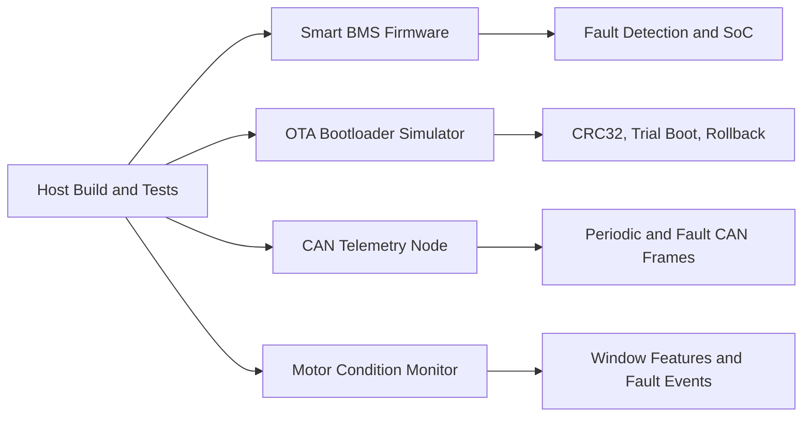

# Embedded Systems Portfolio Lab

[](https://github.com/akifitu/embedded-systems-portfolio-lab/actions/workflows/ci.yml)
[](LICENSE)
[](https://en.wikipedia.org/wiki/C_(programming_language))

This repository is an embedded-systems portfolio designed to look credible on
GitHub before any real board is connected. The code is written in portable C,
builds on the host with a standard compiler, and models the kind of firmware
problems that show up in production teams.

## Portfolio Signal

- Safety and control logic through a battery-management state machine
- Reliability and upgrade strategy through an A/B OTA bootloader model
- Bus communication literacy through a CAN telemetry scheduler
- Embedded diagnostics and fixed-point friendly DSP through a motor monitor
- Repeatability through `make test` and a GitHub Actions CI pipeline

## System Map



## Projects

| Project | Focus | Demo | Deep Dive |
| --- | --- | --- | --- |
| `smart-bms-firmware` | State machine, balancing, faults, SoC | `make run-bms` | [Architecture](projects/smart-bms-firmware/docs/ARCHITECTURE.md) |
| `ota-bootloader-simulator` | A/B staging, CRC32, confirm, rollback | `make run-ota` | [Architecture](projects/ota-bootloader-simulator/docs/ARCHITECTURE.md) |
| `can-telemetry-node` | CAN scheduling, fault priority, frame packing | `make run-can` | [Architecture](projects/can-telemetry-node/docs/ARCHITECTURE.md) |
| `motor-condition-monitor` | Windowed vibration analysis, fault classification, event log | `make run-motor` | [Architecture](projects/motor-condition-monitor/docs/ARCHITECTURE.md) |

## Recorded Demo Snapshots

### Smart BMS Firmware

```text
step=0 state=IDLE soc=72.00 charge=1 discharge=1 faults=none balancing=[0 0 0 0]
step=1 state=CHARGING soc=72.02 charge=1 discharge=0 faults=none balancing=[0 0 0 1]
step=2 state=CHARGING soc=72.03 charge=1 discharge=0 faults=none balancing=[0 0 0 1]
step=3 state=DISCHARGING soc=72.00 charge=0 discharge=1 faults=none balancing=[0 0 0 0]
step=4 state=FAULT soc=72.00 charge=0 discharge=0 faults= overtemp balancing=[0 0 0 0]
```

### OTA Bootloader Simulator

```text
factory: v1.0.0 crc=19A140E2 size=16 confirmed=1
after test upgrade reboot: v1.1.0 crc=4CE93DFC size=22 confirmed=0
reboot without confirm: v1.0.0 crc=19A140E2 size=16 confirmed=1
after permanent upgrade reboot: v1.2.0 crc=0E7C2932 size=27 confirmed=1
final reboot: v1.2.0 crc=0E7C2932 size=27 confirmed=1
```

### CAN Telemetry Node

```text
tick=2 emitted=3
  vcan0 080 [2] 07 00 00 00 00 00 00 00
  vcan0 180 [6] 60 04 1E 00 D4 02 00 00
  vcan0 280 [4] 16 03 07 00 00 00 00 00
tick=4 emitted=2
  vcan0 080 [2] 00 00 00 00 00 00 00 00
  vcan0 180 [6] C0 12 28 00 CD 02 00 00
```

### Motor Condition Monitor

```text
phase=imbalance fault=IMBALANCE sev=WARNING rms=636 p2p=1800 jerk=217 current=5200 temp=38.0C events=1
phase=bearing fault=BEARING_WEAR sev=WARNING rms=740 p2p=2300 jerk=1262 current=5600 temp=41.0C events=2
phase=stall fault=STALL sev=CRITICAL rms=39 p2p=120 jerk=18 current=9800 temp=44.0C events=3
```

## Build

Build and test everything:

```sh
make all
make test
```

Run project demos:

```sh
make run-bms
make run-ota
make run-can
make run-motor
```

## Why This Set Works on GitHub

- It covers control, reliability, and communications instead of only toy sensor code.
- Each project produces deterministic output that reviewers can inspect quickly.
- The repository is split into standalone subprojects that can later become separate repos.

## Suggested Next Hardware Targets

- Port the BMS project to STM32 or ESP32 with ADC, GPIO, and contactor control
- Port the OTA simulator to Zephyr or MCUboot integration tests
- Bridge the CAN node to Linux `vcan` or a real MCP2515 transceiver
- Port the motor monitor to an accelerometer + DMA ADC capture chain on STM32

## References

- Zephyr native host execution:
  https://docs.zephyrproject.org/3.7.0/boards/native/native_posix/doc/index.html
- SocketCAN overview and `vcan` virtual interfaces:
  https://docs.kernel.org/networking/can.html
- MCUboot image signing and upgrade concepts:
  https://docs.mcuboot.com/signed_images.html
  https://docs.mcuboot.com/imgtool.html
