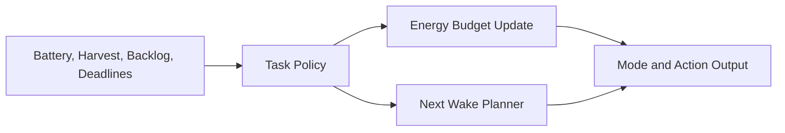

# Energy Harvesting Node Architecture

## Overview

This project models an embedded controller that arbitrates sensing and uplink
tasks under a limited energy budget. It protects a brownout reserve and chooses
between performance, balanced, and survival behaviors.

## Core Modules

- `task_policy.c`: selects the next action and operating mode
- `energy_budget.c`: updates battery energy after work and harvest
- `node_controller.c`: integrates policy and budget into a single step
- `main.c`: deterministic demo through changing environmental phases

## Embedded Value

- Demonstrates low-power scheduling instead of only steady-state logic
- Makes wake intervals and reserve protection explicit and testable
- Creates a direct bridge to RTC, PMIC, and radio stack integration on hardware

