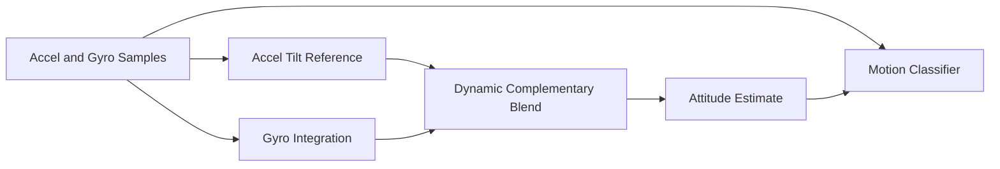

# IMU Attitude Estimator Architecture

## Overview

This project models an embedded complementary filter for roll and pitch
tracking. Gyro rates provide short-term dynamics while accelerometer geometry
provides long-term correction when acceleration magnitude is trustworthy.

## Core Modules

- `complementary_filter.c`: roll and pitch state update
- `motion_classifier.c`: stable, tracking, vibration, and freefall classification
- `attitude_estimator.c`: integration point for filter and motion output
- `main.c`: deterministic phase replay for review and debugging

## Embedded Value

- Demonstrates real sensor fusion and confidence weighting
- Makes degraded conditions visible instead of trusting all acceleration equally
- Creates a clean bridge to real IMU drivers and AHRS expansion

