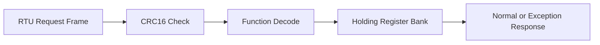

# Modbus RTU Field Node Architecture

## Overview

This project models an RTU slave with a compact register bank. Incoming frames
are CRC-checked, decoded by function code, mapped into register operations, and
returned as normal or exception responses.

## Core Modules

- `modbus_crc.c`: Modbus RTU CRC16 generation
- `register_bank.c`: holding registers with validation rules
- `modbus_rtu.c`: request decode and response encode
- `main.c`: deterministic demo replaying field requests

## Embedded Value

- Demonstrates industrial framing instead of ad-hoc serial protocols
- Makes register maps and fault semantics explicit
- Creates a direct bridge to UART DMA and RS-485 hardware integration

