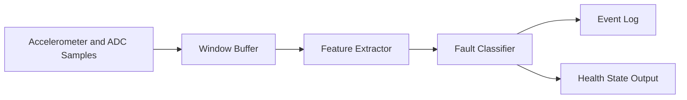

# Motor Condition Monitor Architecture

## Overview

This project models a predictive-maintenance firmware task that observes motor
vibration and supporting operating signals in a fixed-size window, extracts
portable integer-friendly features, classifies the most likely fault, and logs
state transitions.

## Core Modules

- `feature_extractor.c`: computes RMS, peak-to-peak, jerk, current, and temperature stats
- `fault_classifier.c`: maps features to named motor-health states
- `event_log.c`: stores bounded transition history
- `condition_monitor.c`: owns the ring buffer and integrates the pipeline
- `main.c`: drives healthy and faulted phases for a deterministic demo

## Embedded Value

- Demonstrates streaming signal processing rather than one-shot logic
- Uses bounded memory and integer arithmetic suitable for MCUs
- Separates feature extraction from classification for easier tuning on hardware
