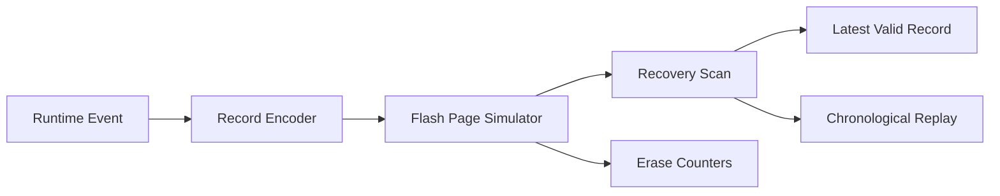

# Resilient Flash Journal Architecture

## Overview

This project models a bounded flash journal that records critical events in
fixed-size slots. Each record carries a sequence number, CRC16, and commit tag
so mount-time recovery can ignore partially written records after a crash.

## Core Modules

- `flash_sim.c`: raw page storage, slot access, blank checks, and erase counters
- `crc16.c`: compact integrity check for slot contents
- `journal.c`: append, mount, recovery, and replay logic
- `main.c`: deterministic demo covering torn writes and page reuse

## Embedded Value

- Demonstrates flash persistence design instead of RAM-only examples
- Surfaces crash recovery rules explicitly
- Gives a direct path to real SPI NOR, EEPROM, or FRAM backends

