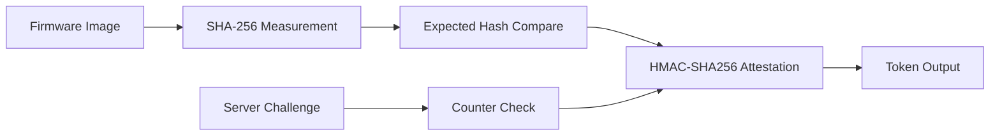

# Secure Attestation Node Architecture

## Overview

This project models a device that measures firmware with SHA-256 and uses a
device secret to generate HMAC-SHA256 attestation tokens for backend
challenges. A monotonic counter blocks stale challenge reuse.

## Core Modules

- `sha256.c`: firmware measurement primitive
- `hmac_sha256.c`: attestation MAC primitive
- `attestation_node.c`: device state, measurement check, and counter rules
- `main.c`: deterministic demo of valid, stale, updated, and tampered cases

## Embedded Value

- Demonstrates security primitives in a firmware-friendly form
- Separates measurement and attestation logic for easier hardware backend swaps
- Creates a clean bridge to secure boot and identity attestation work

